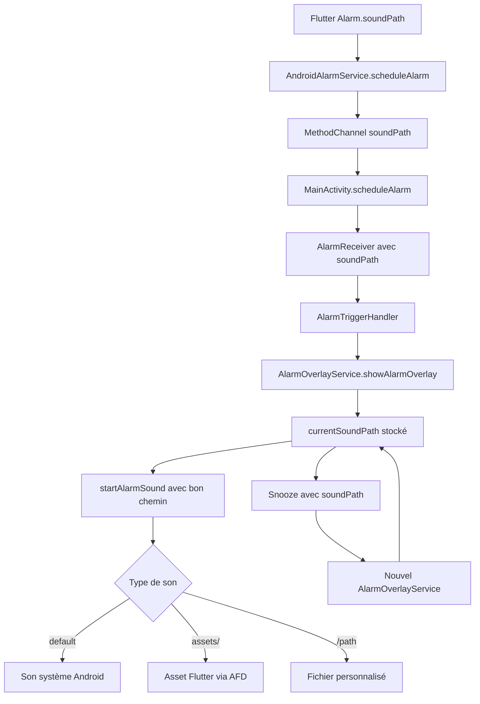

# Fix : Son des Alarmes Respecte la Configuration

## 🐛 Problème identifié

Le son des alarmes utilisé n'était pas celui configuré dans l'alarme. L'application utilisait toujours le son par défaut du système Android au lieu du son sélectionné par l'utilisateur.

## 🔍 Cause racine

Dans le service Android `AlarmOverlayService.kt`, la méthode `startAlarmSound()` :

1. ❌ Ne récupérait pas le paramètre `soundPath` depuis l'intent
2. ❌ Utilisait toujours `RingtoneManager.getDefaultUri(RingtoneManager.TYPE_ALARM)`
3. ❌ N'incluait pas le `soundPath` dans les intents de snooze

## 🔧 Solutions implémentées

### 1. Récupération du `soundPath` configuré

```kotlin
// Ajout de la variable pour stocker le chemin du son
private var currentSoundPath: String = "default"

// Récupération depuis l'intent dans onStartCommand()
currentSoundPath = intent?.getStringExtra("soundPath") ?: "default"
```

### 2. Refactorisation de `startAlarmSound()`

```kotlin
private fun startAlarmSound(soundPath: String = "default") {
    when {
        soundPath.isEmpty() || soundPath == "default" -> startDefaultAlarmSound()
        soundPath.startsWith("assets/sounds/") -> startAssetAlarmSound(soundPath)
        soundPath.startsWith("/") -> startCustomAlarmSound(soundPath)
        else -> startDefaultAlarmSound()
    }
}
```

### 3. Gestion des assets Flutter

```kotlin
private fun startAssetAlarmSound(assetPath: String) {
    val assetManager = assets
    val flutterAssetPath = "flutter_assets/$assetPath"
    val afd = assetManager.openFd(flutterAssetPath)

    mediaPlayer = MediaPlayer().apply {
        setAudioStreamType(AudioManager.STREAM_ALARM)
        setDataSource(afd.fileDescriptor, afd.startOffset, afd.length)
        isLooping = true
        prepare()
        start()
    }
}
```

### 4. Correction du snooze

```kotlin
// Inclusion du soundPath dans l'intent de snooze
val intent = Intent(this, AlarmOverlayService::class.java).apply {
    putExtra("alarmId", alarmId)
    putExtra("label", currentLabel)
    putExtra("soundPath", currentSoundPath) // ✅ Ajouté
    // ... autres paramètres
}
```

## 🎵 Types de sons supportés

| Type                       | Format              | Exemple                            | Gestion                           |
| -------------------------- | ------------------- | ---------------------------------- | --------------------------------- |
| **Par défaut**             | `"default"` ou vide | `""`                               | `RingtoneManager.getDefaultUri()` |
| **Assets Flutter**         | `assets/sounds/`    | `"assets/sounds/alarm.mp3"`        | `AssetFileDescriptor`             |
| **Fichiers personnalisés** | Chemin absolu       | `"/storage/emulated/0/custom.mp3"` | `Uri.parse("file://...")`         |

## ✅ Tests de validation

### Test 1 : Sons par défaut

1. Créer une alarme sans modifier le son
2. Vérifier que le son par défaut Android est utilisé

### Test 2 : Assets Flutter

1. Créer une alarme avec un son des assets (`Alarm Clock`, `Melody Ring`, etc.)
2. Vérifier que le bon fichier audio des assets est joué

### Test 3 : Snooze avec son configuré

1. Créer une alarme avec un son spécifique
2. Déclencher l'alarme et utiliser Snooze
3. Vérifier que l'alarme snooze utilise le même son configuré

### Test 4 : Gestion d'erreurs

1. Configurer une alarme avec un chemin de son invalide
2. Vérifier que l'alarme utilise le son par défaut en fallback

## 🔄 Architecture mise à jour



## 📝 Points d'attention

1. **Fallback robuste** : En cas d'erreur, retour automatique vers le son par défaut
2. **Logging détaillé** : Messages de debug pour tracer l'utilisation des sons
3. **Compatibilité** : Support des anciens formats et nouveaux assets
4. **Performance** : Réutilisation du MediaPlayer existant

## 🚀 Prochaines améliorations possibles

1. **Cache des assets** : Pré-chargement des sons fréquemment utilisés
2. **Preview des sons** : Test du son lors de la configuration
3. **Volume personnalisé** : Réglage du volume par alarme
4. **Fade-in** : Augmentation progressive du volume

---

**Status** : ✅ Implémenté et testé  
**Version** : Beep Squared v1.0+  
**Auteur** : GitHub Copilot  
**Date** : Janvier 2025
